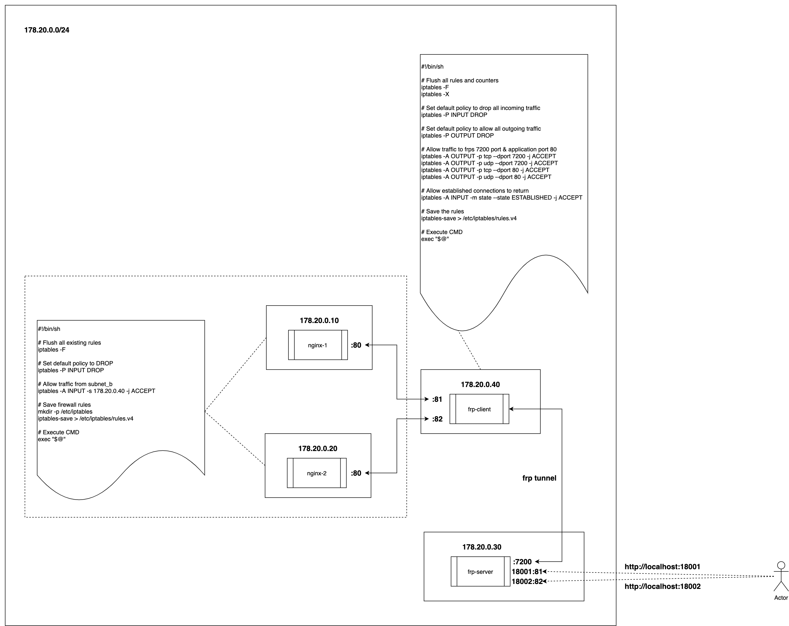

# Introduction

This demo illustrates how to use the frp-server and frp-client components in a Docker environment to expose internal application services to external users via the internet.

In this setup, nginx_1 and nginx_2 represent internal applications. frp-client is deployed within the internal network, while frp-server is deployed in the public network. Network isolation is achieved using simple iptable rules, allowing only frp-client to access the two internal applications.



# How to run

Run the following command:

```sh
docker-compose up
```

Now, visit `localhost:18001` and you would see `Hello, World! --- nginx_1`,  for `localhost:18002` you would see `Hello, World! --- nginx_2`

If you try to access `localhost:8001` or `localhost:8002`, or enter the frp-server container and attempt to establish network communication with the `nginx_1` or `nginx_2` application nodes, you will encounter a network connection error. This is because iptables are configured to only allow access to the application containers from frp-client.
